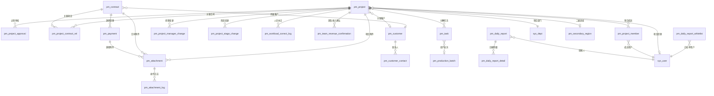
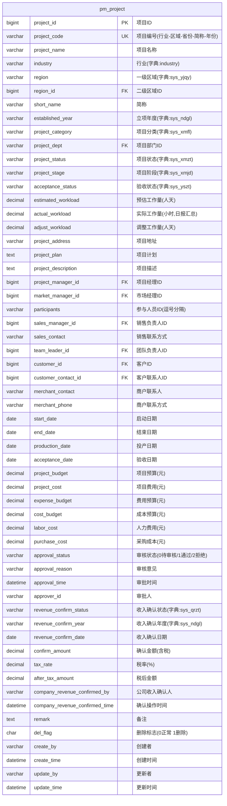
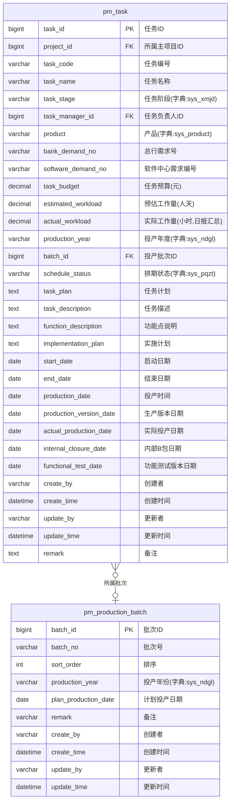
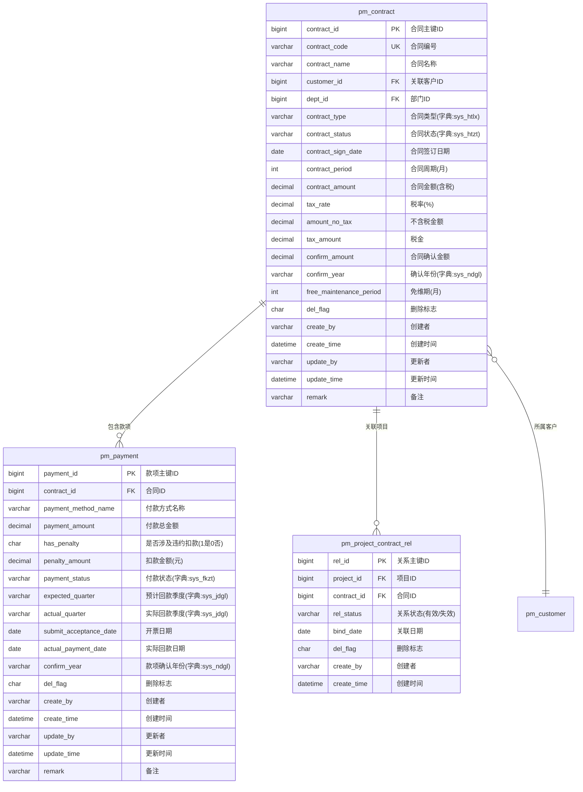
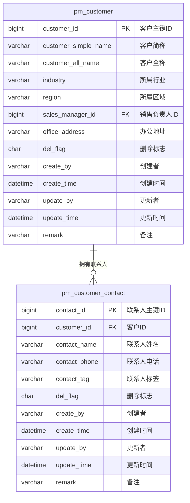
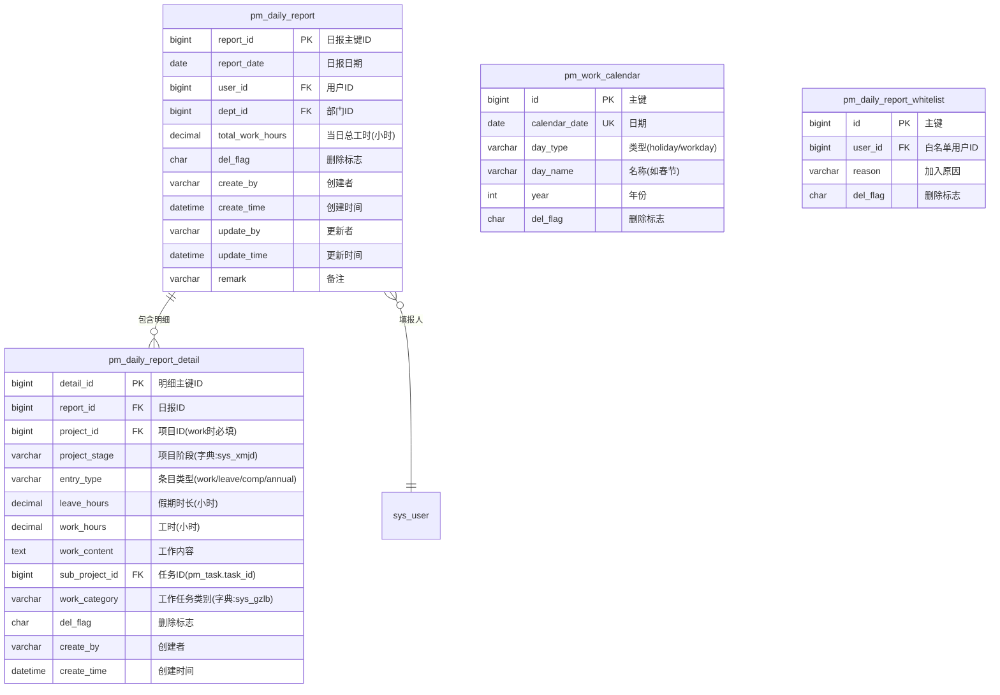
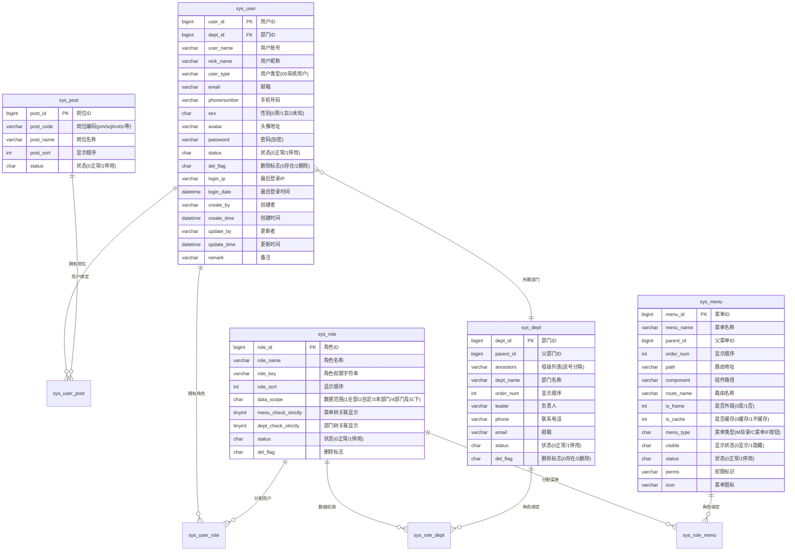
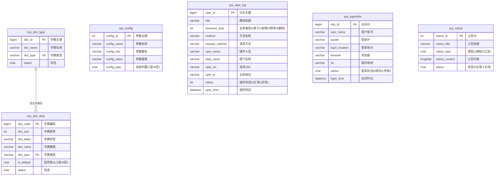

# 数据库 ER 图文档

> 数据库：`ry-vue` | MySQL 8.x | 字符集：`utf8mb4`
>
> 更新日期：2026-03-31（V1.1，基于 YML specs + 源码校准）

---

## 一、PM 业务模块 ER 图

### 1.1 核心业务关系总览



### 1.2 项目管理表 `pm_project`



### 1.3 任务管理表 `pm_task`



### 1.4 合同与款项



### 1.5 客户管理



### 1.6 日报管理



### 1.7 辅助业务表

```mermaid
erDiagram
    pm_project_approval {
        bigint approval_id PK "审核主键ID"
        bigint project_id FK "项目ID"
        varchar approval_status "审核状态(0待审核/1通过/2拒绝)"
        text approval_reason "审核意见"
        bigint approver_id FK "审核人ID"
        datetime approval_time "审核时间"
        char del_flag "删除标志"
        varchar create_by "创建者"
        datetime create_time "创建时间"
    }

    pm_project_member {
        bigint member_id PK "成员主键ID"
        bigint project_id FK "项目ID"
        bigint user_id FK "用户ID"
        date join_date "加入日期"
        date leave_date "离开日期"
        char is_active "是否在项目中(1是0否)"
        char del_flag "删除标志"
    }

    pm_project_manager_change {
        bigint change_id PK "变更主键ID"
        bigint project_id FK "项目ID"
        bigint old_manager_id FK "原项目经理ID"
        bigint new_manager_id FK "新项目经理ID"
        varchar change_reason "变更原因"
        char del_flag "删除标志"
        varchar create_by "创建者"
        datetime create_time "创建时间"
    }

    pm_project_stage_change {
        bigint change_id PK "变更记录ID"
        bigint project_id FK "项目ID"
        varchar old_stage "变更前阶段(字典:sys_xmjd)"
        varchar new_stage "变更后阶段(字典:sys_xmjd)"
        varchar old_project_status "变更前状态(字典:sys_xmzt)"
        varchar new_project_status "变更后状态(字典:sys_xmzt)"
        varchar change_reason "变更原因"
        char del_flag "删除标志"
    }

    pm_team_revenue_confirmation {
        bigint team_confirm_id PK "团队确认ID"
        bigint project_id FK "项目ID"
        bigint dept_id FK "部门ID"
        decimal confirm_amount "确认金额"
        datetime confirm_time "确认时间"
        bigint confirm_user_id FK "确认人ID"
        varchar remark "备注"
        char del_flag "删除标志"
    }

    pm_workload_correct_log {
        bigint log_id PK "日志ID"
        bigint project_id FK "项目ID"
        tinyint direction "调整方向(0增加/1减少)"
        decimal delta "调整人天数"
        decimal before_adjust "调整前值"
        decimal after_adjust "调整后值"
        varchar reason "补正理由"
        varchar create_by "创建者"
        datetime create_time "创建时间"
    }

    pm_secondary_region {
        bigint region_id PK "二级区域ID"
        varchar region_code UK "区域代码"
        varchar region_name "区域名称"
        varchar region_type "类型(省/直辖市/自治区/特别行政区)"
        varchar region_dict_value FK "一级区域字典值"
        int sort_order "排序"
        char status "状态"
        char del_flag "删除标志"
    }

    pm_attachment {
        bigint attachment_id PK "附件主键ID"
        varchar business_type "业务类型(project/contract/payment)"
        bigint business_id "业务ID"
        varchar document_type "文档类型(字典:sys_wdlx)"
        varchar file_name "文件名"
        varchar file_path "文件路径"
        bigint file_size "文件大小(字节)"
        varchar file_type "文件类型(扩展名)"
        varchar file_description "文件描述"
        char del_flag "删除标志"
    }

    pm_attachment_log {
        bigint log_id PK "日志主键ID"
        bigint attachment_id FK "附件ID"
        varchar business_type "业务类型"
        bigint business_id "业务ID"
        varchar operation_type "操作类型(upload/delete/download)"
        varchar operation_desc "操作描述"
        bigint operator_id "操作人ID"
        varchar operator_name "操作人姓名"
        datetime operation_time "操作时间"
    }
```



---

## 二、RuoYi 系统管理模块 ER 图

### 2.1 用户-角色-部门-权限 关系



### 2.2 关联表（多对多）

```mermaid
erDiagram
    sys_user_role {
        bigint user_id PK_FK "用户ID"
        bigint role_id PK_FK "角色ID"
    }

    sys_role_menu {
        bigint role_id PK_FK "角色ID"
        bigint menu_id PK_FK "菜单ID"
    }

    sys_role_dept {
        bigint role_id PK_FK "角色ID"
        bigint dept_id PK_FK "部门ID"
    }

    sys_user_post {
        bigint user_id PK_FK "用户ID"
        bigint post_id PK_FK "岗位ID"
    }
```

### 2.3 系统辅助表



---

## 三、完整表清单

### 3.1 PM 业务表（21张）

| 序号 | 表名 | 中文名 | 删除策略 | 说明 |
|------|------|--------|----------|------|
| 1 | `pm_project` | 项目管理表 | **硬删除** | 核心主表 |
| 2 | `pm_project_approval` | 项目审核表 | 软删除 | 审批工作流记录 |
| 3 | `pm_task` | 任务管理表 | **硬删除** | 项目分解任务 |
| 4 | `pm_production_batch` | 投产批次表 | **硬删除**（无 del_flag 列）| 批次管理 |
| 5 | `pm_contract` | 合同管理表 | 软删除 | 合同信息 |
| 6 | `pm_project_contract_rel` | 项目合同关系表 | 软删除 | 多对多关联 |
| 7 | `pm_payment` | 款项表 | 软删除 | 付款里程碑 |
| 8 | `pm_customer` | 客户信息表 | 软删除 | 客户管理 |
| 9 | `pm_customer_contact` | 客户联系人表 | 软删除 | 联系人信息 |
| 10 | `pm_project_member` | 项目人员管理表 | 软删除 | 项目成员 |
| 11 | `pm_project_manager_change` | 项目经理变更表 | 软删除 | 变更记录 |
| 12 | `pm_project_stage_change` | 项目阶段变更表 | 软删除 | 阶段变更记录 |
| 13 | `pm_team_revenue_confirmation` | 团队收入确认表 | 软删除 | 团队维度收入 |
| 14 | `pm_daily_report` | 日报主表 | **硬删除** | 一人一天一条 |
| 15 | `pm_daily_report_detail` | 日报明细表 | **硬删除** | 项目工时明细 |
| 16 | `pm_work_calendar` | 工作日历表 | 软删除 | 节假日/调休 |
| 17 | `pm_daily_report_whitelist` | 日报白名单表 | 软删除 | 免填日报人员 |
| 18 | `pm_secondary_region` | 二级区域表 | 软删除 | 省/直辖市/自治区 |
| 19 | `pm_attachment` | 附件表 | 软删除 | 文件附件 |
| 20 | `pm_attachment_log` | 附件操作日志表 | 无 del_flag | 审计日志 |
| 21 | `pm_workload_correct_log` | 工作量补正日志 | 无 del_flag | 人天补正审计 |

### 3.2 RuoYi 系统表（19张）

| 序号 | 表名 | 中文名 | 说明 |
|------|------|--------|------|
| 1 | `sys_user` | 用户信息表 | 系统用户 |
| 2 | `sys_dept` | 部门表 | 树形结构 |
| 3 | `sys_role` | 角色信息表 | RBAC 角色 |
| 4 | `sys_menu` | 菜单权限表 | 路由+按钮权限 |
| 5 | `sys_post` | 岗位信息表 | pm/scjl/xsfzr 等 |
| 6 | `sys_user_role` | 用户角色关联表 | 多对多 |
| 7 | `sys_role_menu` | 角色菜单关联表 | 多对多 |
| 8 | `sys_role_dept` | 角色部门关联表 | 数据权限 |
| 9 | `sys_user_post` | 用户岗位关联表 | 多对多 |
| 10 | `sys_dict_type` | 字典类型表 | 字典分类 |
| 11 | `sys_dict_data` | 字典数据表 | 字典项 |
| 12 | `sys_config` | 参数配置表 | 系统参数 |
| 13 | `sys_oper_log` | 操作日志记录 | 审计日志 |
| 14 | `sys_logininfor` | 系统访问记录 | 登录日志 |
| 15 | `sys_notice` | 通知公告表 | 站内通知 |
| 16 | `sys_job` | 定时任务调度表 | Quartz 任务 |
| 17 | `sys_job_log` | 定时任务日志表 | 执行日志 |
| 18 | `gen_table` | 代码生成业务表 | 代码生成器 |
| 19 | `gen_table_column` | 代码生成字段表 | 字段配置 |

### 3.3 Quartz 调度表（9张）

| 表名 | 说明 |
|------|------|
| `qrtz_blob_triggers` | Blob 类型触发器 |
| `qrtz_calendars` | 日历信息 |
| `qrtz_cron_triggers` | Cron 类型触发器 |
| `qrtz_fired_triggers` | 已触发触发器 |
| `qrtz_job_details` | 任务详细信息 |
| `qrtz_locks` | 悲观锁信息 |
| `qrtz_paused_trigger_grps` | 暂停的触发器组 |
| `qrtz_scheduler_state` | 调度器状态 |
| `qrtz_simple_triggers` | 简单触发器 |
| `qrtz_simprop_triggers` | 同步行锁 |
| `qrtz_triggers` | 触发器详细信息 |

---

## 四、字典依赖关系

| 字典类型 | 中文名 | 使用表/字段 |
|----------|--------|-------------|
| `industry` | 行业 | `pm_project.industry` |
| `sys_yjqy` | 一级区域 | `pm_project.region`、`pm_secondary_region.region_dict_value` |
| `sys_ndgl` | 年度管理 | `pm_project.established_year/revenue_confirm_year`、`pm_contract.confirm_year`、`pm_payment.confirm_year`、`pm_task.production_year`、`pm_production_batch.production_year` |
| `sys_xmfl` | 项目分类 | `pm_project.project_category` |
| `sys_xmjd` | 项目阶段 | `pm_project.project_stage`、`pm_task.task_stage`、`pm_daily_report_detail.project_stage`、`pm_project_stage_change.old_stage/new_stage` |
| `sys_xmzt` | 项目状态 | `pm_project.project_status` |
| `sys_yszt` | 验收状态 | `pm_project.acceptance_status` |
| `sys_spzt` | 审核状态 | `pm_project.approval_status` |
| `sys_qrzt` | 确认状态 | `pm_project.revenue_confirm_status` |
| `sys_htlx` | 合同类型 | `pm_contract.contract_type` |
| `sys_htzt` | 合同状态 | `pm_contract.contract_status` |
| `sys_fkzt` | 付款状态 | `pm_payment.payment_status` |
| `sys_jdgl` | 季度管理 | `pm_payment.expected_quarter/actual_quarter` |
| `sys_wdlx` | 文档类型 | `pm_attachment.document_type` |
| `sys_gzlb` | 工作任务类别 | `pm_daily_report_detail.work_category` |
| `sys_pqzt` | 排期状态 | `pm_task.schedule_status` |
| `sys_product` | 产品 | `pm_task.product` |

---

## 五、关键约束与索引说明

### 唯一约束

| 表 | 约束 | 字段 |
|----|------|------|
| `pm_project` | `uk_project_code` | `project_code` |
| `pm_contract` | `uk_contract_code` | `contract_code` |
| `pm_project_contract_rel` | `uk_project_contract` | `project_id, contract_id, del_flag` |
| `pm_daily_report` | `uk_user_date` | `user_id, report_date` |
| `pm_secondary_region` | `uk_region_code` | `region_code` |
| `pm_work_calendar` | `uk_calendar_date` | `calendar_date` |

### Collation 注意事项

PM 业务表多数使用 `utf8mb4_0900_ai_ci`，系统表使用 `utf8mb4_unicode_ci`。跨模块 JOIN 时必须显式指定 COLLATE：

```sql
-- 示例：项目表 JOIN 系统用户表
LEFT JOIN sys_user u
  ON p.update_by COLLATE utf8mb4_unicode_ci = u.user_name

-- 示例：项目阶段 JOIN 字典表
LEFT JOIN sys_dict_data d
  ON t.type COLLATE utf8mb4_unicode_ci = d.dict_value
```
