# 项目管理系统 ER 图

## 数据库表关系图

```mermaid
erDiagram
    %% 客户管理模块
    pm_customer {
        bigint customer_id PK
        varchar customer_simple_name
        varchar customer_all_name
        varchar industry
        varchar region
        bigint sales_manager_id
        varchar sales_manager_name
        varchar office_address
        char del_flag
        varchar create_by
        datetime create_time
        varchar update_by
        datetime update_time
        varchar remark
    }

    pm_customer_contact {
        bigint contact_id PK
        bigint customer_id FK
        varchar contact_name
        varchar contact_phone
        varchar contact_tag
        char del_flag
        varchar create_by
        datetime create_time
        varchar update_by
        datetime update_time
        varchar remark
    }

    %% 合同管理模块
    pm_contract {
        bigint contract_id PK
        varchar contract_code UK
        varchar contract_name
        bigint customer_id FK
        varchar customer_name
        bigint dept_id
        varchar dept_name
        bigint team_id
        bigint team_leader_id
        varchar contract_type
        varchar contract_status
        date contract_sign_date
        int contract_period
        decimal contract_amount
        decimal tax_rate
        decimal amount_no_tax
        decimal tax_amount
        decimal confirm_amount
        varchar confirm_year
        int free_maintenance_period
        char del_flag
        varchar create_by
        datetime create_time
        varchar update_by
        datetime update_time
        varchar remark
    }

    pm_payment {
        bigint payment_id PK
        bigint contract_id FK
        varchar payment_method_name
        char has_penalty
        decimal penalty_amount
        varchar payment_status
        varchar expected_quarter
        varchar actual_quarter
        date submit_acceptance_date
        date actual_payment_date
        varchar flow_status
        varchar confirm_year
        char del_flag
        varchar create_by
        datetime create_time
        varchar update_by
        datetime update_time
        varchar remark
    }

    pm_payment_milestone {
        bigint milestone_id PK
        bigint payment_id FK
        varchar milestone_name
        decimal milestone_amount
        int milestone_order
        char del_flag
        varchar create_by
        datetime create_time
        varchar update_by
        datetime update_time
        varchar remark
    }

    %% 项目管理模块
    pm_project {
        bigint project_id PK
        varchar project_code UK
        varchar project_name
        varchar project_full_name
        varchar industry
        varchar region
        varchar short_name
        int year
        varchar project_category
        varchar project_dept
        varchar project_status
        varchar acceptance_status
        decimal estimated_workload
        decimal actual_workload
        varchar project_address
        text project_plan
        text project_description
        bigint project_manager_id
        bigint market_manager_id
        varchar participants
        bigint sales_manager_id
        varchar sales_contact
        bigint team_leader_id
        bigint customer_id FK
        bigint customer_contact_id FK
        varchar merchant_contact
        varchar merchant_phone
        date start_date
        date end_date
        date production_date
        date acceptance_date
        varchar implementation_year
        decimal project_budget
        decimal project_cost
        decimal cost_budget
        decimal budget_cost
        decimal labor_cost
        decimal purchase_cost
        varchar approval_status
        varchar approval_reason
        varchar industry_code
        varchar region_code
        datetime approval_time
        varchar approver_id
        text remark
        decimal tax_rate
        bigint confirm_user_id
        datetime confirm_time
        char del_flag
        varchar create_by
        datetime create_time
        varchar update_by
        datetime update_time
        char confirm_status
        varchar confirm_quarter
        decimal confirm_amount
        decimal after_tax_amount
        varchar confirm_user_name
    }

    pm_project_member {
        bigint member_id PK
        bigint project_id FK
        bigint user_id FK
        date join_date
        date leave_date
        char is_active
        char del_flag
        varchar create_by
        datetime create_time
        varchar update_by
        datetime update_time
        varchar remark
    }

    pm_project_approval {
        bigint approval_id PK
        bigint project_id FK
        varchar approval_status
        text approval_reason
        bigint approver_id
        datetime approval_time
        char del_flag
        varchar create_by
        datetime create_time
        varchar update_by
        datetime update_time
        varchar remark
    }

    pm_project_contract_rel {
        bigint rel_id PK
        varchar project_id FK
        varchar project_name
        bigint contract_id FK
        varchar contract_name
        varchar rel_type
        char is_main
        varchar rel_status
        date bind_date
        char del_flag
        varchar create_by
        datetime create_time
        varchar update_by
        datetime update_time
        varchar remark
    }

    pm_team_revenue_confirmation {
        bigint team_confirm_id PK
        bigint project_id FK
        bigint dept_id FK
        decimal confirm_amount
        datetime confirm_time
        bigint confirm_user_id
        varchar remark
        char del_flag
        varchar create_by
        datetime create_time
        varchar update_by
        datetime update_time
    }

    %% 附件管理模块
    pm_attachment {
        bigint attachment_id PK
        varchar business_type
        bigint business_id
        varchar project_id
        bigint contract_id
        varchar document_type
        varchar file_name
        varchar file_path
        bigint file_size
        varchar file_type
        varchar file_description
        char del_flag
        varchar create_by
        datetime create_time
        varchar update_by
        datetime update_time
        varchar remark
    }

    %% 系统管理模块
    sys_user {
        bigint user_id PK
        bigint dept_id FK
        varchar user_name UK
        varchar nick_name
        varchar user_type
        varchar email
        varchar phonenumber
        char sex
        varchar avatar
        varchar password
        char status
        char del_flag
        varchar login_ip
        datetime login_date
        datetime pwd_update_date
        varchar create_by
        datetime create_time
        varchar update_by
        datetime update_time
        varchar remark
    }

    sys_dept {
        bigint dept_id PK
        bigint parent_id
        varchar ancestors
        varchar dept_name
        int order_num
        varchar leader
        varchar phone
        varchar email
        char status
        char del_flag
        varchar create_by
        datetime create_time
        varchar update_by
        datetime update_time
    }

    sys_role {
        bigint role_id PK
        varchar role_name
        varchar role_key UK
        int role_sort
        char data_scope
        tinyint menu_check_strictly
        tinyint dept_check_strictly
        char status
        char del_flag
        varchar create_by
        datetime create_time
        varchar update_by
        datetime update_time
        varchar remark
    }

    sys_menu {
        bigint menu_id PK
        varchar menu_name
        bigint parent_id
        int order_num
        varchar path
        varchar component
        varchar query
        varchar route_name
        int is_frame
        int is_cache
        char menu_type
        char visible
        char status
        varchar perms
        varchar icon
        varchar create_by
        datetime create_time
        varchar update_by
        datetime update_time
        varchar remark
    }

    %% 关联表
    sys_user_role {
        bigint user_id PK,FK
        bigint role_id PK,FK
    }

    sys_role_menu {
        bigint role_id PK,FK
        bigint menu_id PK,FK
    }

    sys_user_post {
        bigint user_id PK,FK
        bigint post_id PK,FK
    }

    sys_role_dept {
        bigint role_id PK,FK
        bigint dept_id PK,FK
    }

    sys_post {
        bigint post_id PK
        varchar post_code UK
        varchar post_name
        int post_sort
        char status
        varchar create_by
        datetime create_time
        varchar update_by
        datetime update_time
        varchar remark
    }

    %% 代码生成模块
    gen_table {
        bigint table_id PK
        varchar table_name
        varchar table_comment
        varchar sub_table_name
        varchar sub_table_fk_name
        varchar class_name
        varchar tpl_category
        varchar tpl_web_type
        varchar package_name
        varchar module_name
        varchar business_name
        varchar function_name
        varchar function_author
        char gen_type
        varchar gen_path
        varchar options
        varchar create_by
        datetime create_time
        varchar update_by
        datetime update_time
        varchar remark
    }

    gen_table_column {
        bigint column_id PK
        bigint table_id FK
        varchar column_name
        varchar column_comment
        varchar column_type
        varchar java_type
        varchar java_field
        char is_pk
        char is_increment
        char is_required
        char is_insert
        char is_edit
        char is_list
        char is_query
        varchar query_type
        varchar html_type
        varchar dict_type
        int sort
        varchar create_by
        datetime create_time
        varchar update_by
        datetime update_time
    }

    %% 关系定义
    pm_customer ||--o{ pm_customer_contact : "has contacts"
    pm_customer ||--o{ pm_contract : "signs contracts"
    pm_customer ||--o{ pm_project : "owns projects"

    pm_contract ||--o{ pm_payment : "has payments"
    pm_payment ||--o{ pm_payment_milestone : "has milestones"

    pm_project ||--o{ pm_project_member : "has members"
    pm_project ||--o{ pm_project_approval : "has approvals"
    pm_project ||--o{ pm_project_contract_rel : "links to contracts"
    pm_project ||--o{ pm_team_revenue_confirmation : "has revenue confirmations"
    pm_project ||--o{ pm_attachment : "has attachments"

    pm_contract ||--o{ pm_project_contract_rel : "links to projects"
    pm_contract ||--o{ pm_attachment : "has attachments"

    pm_customer_contact ||--o{ pm_project : "is project contact"

    sys_dept ||--o{ sys_user : "contains users"
    sys_dept ||--o{ pm_team_revenue_confirmation : "confirms revenue"

    sys_user ||--o{ pm_project_member : "participates in projects"
    sys_user ||--o{ sys_user_role : "has roles"
    sys_user ||--o{ sys_user_post : "has posts"

    sys_role ||--o{ sys_user_role : "assigned to users"
    sys_role ||--o{ sys_role_menu : "has menu permissions"
    sys_role ||--o{ sys_role_dept : "has dept permissions"

    sys_menu ||--o{ sys_role_menu : "granted to roles"
    sys_post ||--o{ sys_user_post : "assigned to users"
    sys_dept ||--o{ sys_role_dept : "accessible by roles"

    gen_table ||--o{ gen_table_column : "has columns"
```

## 主要模块说明

### 1. 客户管理模块 (Customer Management)
- **pm_customer**: 客户基本信息
- **pm_customer_contact**: 客户联系人信息

### 2. 合同管理模块 (Contract Management)
- **pm_contract**: 合同基本信息
- **pm_payment**: 款项信息
- **pm_payment_milestone**: 款项里程碑

### 3. 项目管理模块 (Project Management)
- **pm_project**: 项目基本信息
- **pm_project_member**: 项目成员
- **pm_project_approval**: 项目审批
- **pm_project_contract_rel**: 项目合同关联
- **pm_team_revenue_confirmation**: 团队收入确认

### 4. 附件管理模块 (Attachment Management)
- **pm_attachment**: 通用附件表，支持多种业务类型

### 5. 系统管理模块 (System Management)
- **sys_user**: 用户信息
- **sys_dept**: 部门信息
- **sys_role**: 角色信息
- **sys_menu**: 菜单权限
- **sys_post**: 岗位信息
- 各种关联表实现用户-角色-权限体系

### 6. 代码生成模块 (Code Generation)
- **gen_table**: 代码生成表配置
- **gen_table_column**: 代码生成字段配置

### 7. 任务调度模块 (Quartz Scheduler)
- **qrtz_*** 系列表: Quartz任务调度相关表

## 核心业务关系

1. **客户 → 项目 → 合同**: 客户可以有多个项目，项目可以关联多个合同
2. **合同 → 款项 → 里程碑**: 合同包含多个款项，每个款项有多个里程碑
3. **项目团队管理**: 项目有成员、审批流程、收入确认等
4. **权限体系**: 用户-角色-菜单的RBAC权限模型
5. **附件系统**: 通用附件表支持项目、合同、款项等多种业务实体